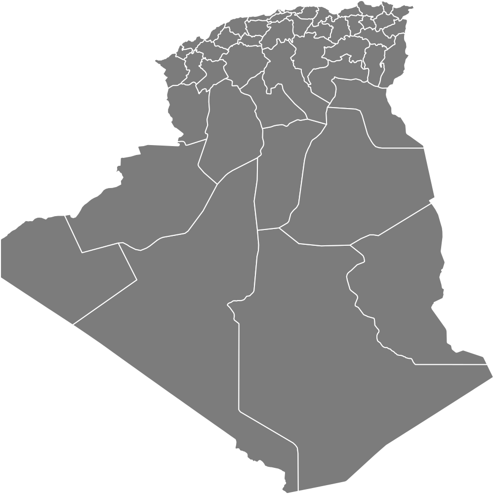

    
  

    
    
    
  

## Algeria administrative division
 - states (wilayas) `states.json`
 - counties (dairas) `counties.json`
 - districts (baladiyah) `districts.json`

## Author

If you find this repo useful, please consider giving it a ⭐

----

Made with :hearts: by <a href="https://github.com/reemaouati">Reem Aouati</a>

